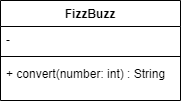
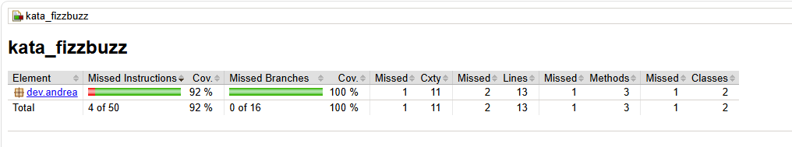

# Kata FizzBuzz

Ejercicio de la kata FizzBuzz en Java, desarrollado con Maven, JUnit 5 y Hamcrest, siguiendo TDD (Test-Driven Development).

## Tecnologías

- Java 21
- Maven
- JUnit 5
- Hamcrest
- JaCoCo (cobertura de tests)

## Enunciado

### Etapa 1

- Devuelve "Fizz" si el número es divisible por 3.
- Devuelve "Buzz" si el número es divisible por 5.
- Devuelve "FizzBuzz" si el número es divisible por 3 y por 5.
- Devuelve el propio número si no se cumple ninguna de las reglas anteriores.

### Etapa 2

- Devuelve "Fizz" si el número es divisible por 3 o si contiene el dígito 3.
- Devuelve "Buzz" si el número es divisible por 5 o si contiene el dígito 5.

## Cómo ejecutar el proyecto

Clona el repositorio y entra en la carpeta del proyecto Maven:

\`\`\`bash
git clone https://github.com/AndreaVaGo/Kata-FizzBuzz.git
cd Kata-FizzBuzz/kata_fizzbuzz
\`\`\`

Ejecuta los tests:

\`\`\`bash
mvn test
\`\`\`

## Diagrama de clase

La clase `FizzBuzz` no tiene atributos y expone un único método público, `convert`, que recibe un número entero y devuelve el resultado según las reglas del enunciado.

## Testing

Siguiendo la metodología TDD (Red-Green), la clase `FizzBuzz` está testeada con 6 tests unitarios que cubren todos los escenarios del enunciado:

| Test | Número de entrada | Resultado esperado |
|---|---|---|
| `shouldReturnFizz` | 3 | Fizz |
| `shouldReturnBuzz` | 5 | Buzz |
| `shouldReturnFizzBuzz` | 15 | FizzBuzz |
| `shouldReturnTheNumber` | 7 | 7 |
| `shouldReturnFizzWhenNumberContainsThree` | 13 | Fizz |
| `shouldReturnBuzzWhenNumberContainsFive` | 52 | Buzz |

## Cobertura de tests (coverage)

Reporte generado con JaCoCo tras ejecutar `mvn test`:

| Métrica | Cobertura |
|---|---|
| Instrucciones | 92% |
| Ramas (branches) | 100% |

## Autor

Andrea — [AndreaVaGo](https://github.com/AndreaVaGo)

